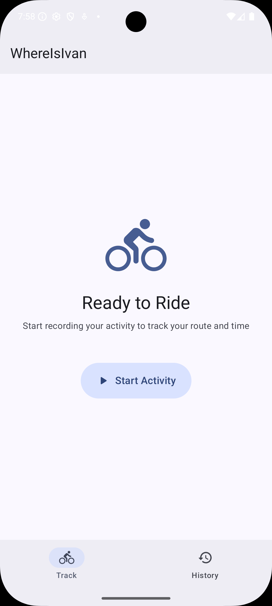
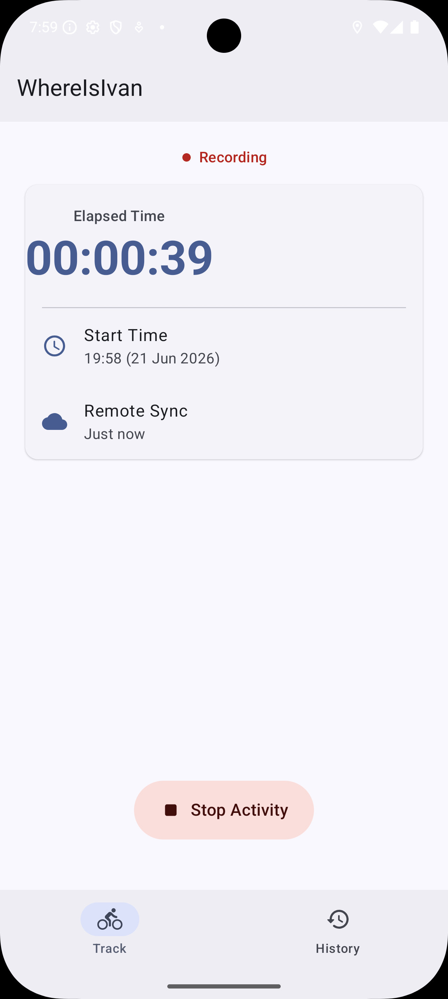

# whereisivan

A personal bicycle tracking application that streams real-time GPS data from an Android device to a Ktor backend and visualises it on a React/Leaflet dashboard. Infrastructure is managed with Terraform on AWS or woth docker compose on local machine.

## Android App

| Idle | Recording |
|------|-----------|
|  |  |

**Main screen (left):** Tap "Start Activity" to begin a ride. Two tabs — Track (current ride) and History (past rides).

**Recording screen (right):** Shows elapsed time, start time, and last remote sync timestamp. Tap "Stop Activity" to end the ride.

## How It Works

The Android app captures the device's GPS position and POSTs location updates to the backend API. The backend stores activity state in memory and serves the React dashboard as embedded static assets. The dashboard displays the cyclist's live position on an interactive map. The entire stack can be deployed to AWS with a single `make deploy` command.

```
Android app  --[HTTPS POST]--> Ktor backend <-- React dashboard
                                    |
                               AWS EC2 (fat JAR)
                               AWS S3 (JAR artifact)
                               AWS Route53 (DNS)
```

## Repository Layout

| Directory | Description |
|-----------|-------------|
| [`android-client/`](android-client/README.md) | Kotlin + Jetpack Compose Android app |
| [`backend/`](backend/README.md) | Kotlin + Ktor REST API (JVM 25) |
| [`dashboard/`](dashboard/README.md) | React 19 + react-leaflet web app |
| [`infra/aws/`](infra/aws/README.md) | Terraform — AWS EC2, S3, Route53 |
| [`infra/docker/`](infra/docker/README.md) | Multi-stage Dockerfile and Docker Compose |
| [`test-client/`](test-client/README.md) | CLI GPX simulator for local testing |
| `scripts/` | Shell helpers invoked by Make targets |
| `Makefile` | Top-level build and deploy orchestration |

## Tech Stack

| Layer | Technologies |
|-------|--------------|
| Backend | Kotlin 2.4.0, Ktor 3.1.3, Koin 3.5.1, kotlinx.serialization, Netty, JVM 25 |
| Android | Kotlin 2.2.10, Jetpack Compose (BOM 2026.05.01), Ktor Client 2.3.11, Koin 3.5.6 |
| Dashboard | React 19.2.7, react-leaflet 5.0.0, react-router-dom 7.17.0 |
| Infrastructure | Terraform (AWS provider >= 6.0), EC2, S3, Route53 |
| Packaging | Docker (Eclipse Temurin 25), Docker Compose |

## Prerequisites

| Tool | Minimum Version |
|------|-----------------|
| JDK | 25 |
| Node.js | 25.4 |
| Docker | 29 |
| Terraform | 1.0 |
| AWS CLI | 2.x |

## Quick Start — Local Development

**1. Start the backend:**

```bash
cd backend
./gradlew run
```

The API starts on http://localhost:8080.

**2. Start the dashboard dev server:**

```bash
cd dashboard
npm install
npm start
```

The dashboard opens at http://localhost:3000.

**3. Simulate a cycling track (no Android device needed):**

```bash
cd test-client
./gradlew run --args="path/to/track.gpx http://localhost:8080"
```

## Build and Deploy

All commands run from the repository root.

```bash
# Build the React dashboard and copy assets into the backend
make build-dashboard

# Compile the backend fat JAR (embeds the dashboard)
make build-backend

# Build and start the full stack locally with Docker Compose
make local-run

# Provision AWS infrastructure and deploy
make deploy

# Tear down AWS infrastructure
make destroy
```

> **Note:** `make build-backend` depends on `make build-dashboard` — always build the dashboard first when updating the frontend, or run `make build-backend` which handles the dependency automatically.

## Deployment Architecture

`make deploy` runs `terraform apply` from `infra/aws/`. Terraform:

1. Uploads the backend fat JAR to an S3 bucket.
2. Provisions an EC2 instance (Amazon Linux, ARM64) with a user-data script that installs Amazon Corretto 21, downloads the JAR from S3, and starts it.
3. Creates a Route53 A record pointing to the EC2 instance.

See [`infra/aws/README.md`](infra/aws/README.md) for Terraform variable reference and state backend configuration.

## Sub-project Documentation

- [Backend](backend/README.md) — API routes, Gradle tasks, Docker image details
- [Android Client](android-client/README.md) — build instructions, `local.properties` configuration
- [Dashboard](dashboard/README.md) — npm scripts, dev proxy setup
- [AWS Infrastructure](infra/aws/README.md) — Terraform variables, remote state, resources
- [Docker](infra/docker/README.md) — multi-stage build, local Docker Compose usage
- [Test Client](test-client/README.md) — GPX simulator usage and standalone JAR build
