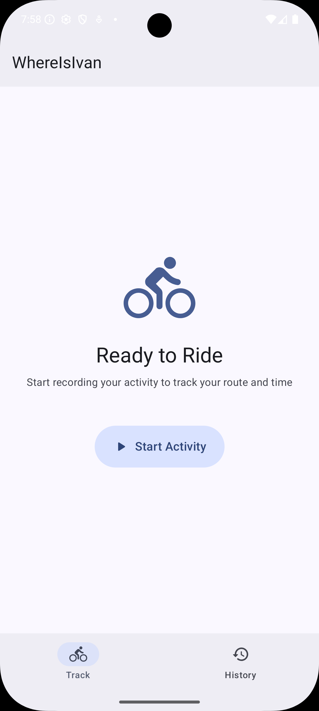
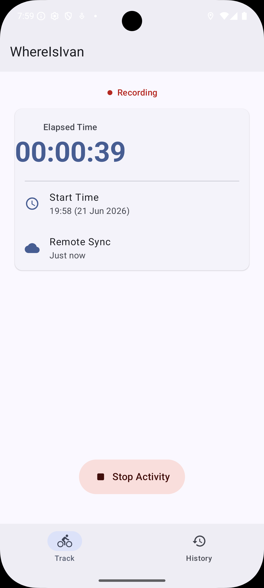

# whereisivan

[](https://github.com/drndivoje/whereisivan/actions/workflows/ci.yml)

A personal bicycle tracking application that streams real-time GPS data from an Android device to a Ktor backend and visualises it on a React/Leaflet dashboard. Infrastructure is managed with Terraform on AWS or woth docker compose on local machine.

## Android App

| Idle | Recording |
|------|-----------|
|  |  |

**Main screen (left):** Tap "Start Activity" to begin a ride. Two tabs — Track (current ride) and History (past rides).

**Recording screen (right):** Shows elapsed time, start time, and last remote sync timestamp. Tap "Stop Activity" to end the ride.

## How It Works

The Android app captures the device's GPS position and POSTs location updates to the backend API. The backend stores activity state in memory and serves the React dashboard as embedded static assets. The dashboard displays the cyclist's live position on an interactive map.
```

## Repository Layout

| Directory | Description |
|-----------|-------------|
| [`android-client/`](android-client/README.md) | Kotlin + Jetpack Compose Android app |
| [`backend/`](backend/README.md) | Kotlin + Ktor REST API (JVM 25) |
| [`dashboard/`](dashboard/README.md) | React 19 + react-leaflet web app |
| [`infra/aws/ecr/`](infra/aws/ecr/README.md) | Terraform — ECR repository (tier 1) |
| [`infra/aws/app/`](infra/aws/app/README.md) | Terraform — EC2, Route53 (tier 2) |
| [`infra/docker/`](infra/docker/README.md) | Multi-stage Dockerfile and Docker Compose |
| [`test-client/`](test-client/README.md) | CLI GPX simulator for local testing |
| `scripts/` | Shell helpers invoked by Make targets |
| `Makefile` | Top-level build and deploy orchestration |

## Tech Stack

| Layer | Technologies |
|-------|--------------|
| Backend | Kotlin 2.4.0, Ktor 3.1.3, Koin 3.5.1, kotlinx.serialization, Netty, JVM 25 |
| Android | Kotlin 2.2.10, Jetpack Compose (BOM 2026.05.01), Ktor Client 2.3.11, Koin 3.5.6 |
| Dashboard | React 19.2.7, react-leaflet 5.0.0, react-router-dom 7.17.0 |
| Infrastructure | Terraform (AWS provider >= 6.0), EC2, ECR, Route53 |
| Packaging | Docker (Eclipse Temurin 25), Docker Compose, Docker Buildx (linux/arm64) |

## Prerequisites

| Tool | Minimum Version |
|------|-----------------|
| JDK | 25 |
| Node.js | 25.4 |
| Docker | 29 |
| Terraform | 1.0 |
| AWS CLI | 2.x |

## Quick Start — Local Development

**1. Start the backend:**

```bash
cd backend
./gradlew run
```

The API starts on http://localhost:8080.

**2. Start the dashboard dev server:**

```bash
cd dashboard
npm install
npm start
```

The dashboard opens at http://localhost:3000.

**3. Simulate a cycling track (no Android device needed):**

```bash
cd test-client
./gradlew run --args="path/to/track.gpx http://localhost:8080"
```

## Build and Deploy

All commands run from the repository root.

```bash
# Build and start the full stack locally with Docker Compose
make local-run

# Provision the ECR repository (tier 1, only needed once)
make deploy-ecr

# Build the linux/arm64 backend image and push :latest to ECR
make push-image

# Provision the EC2 instance that pulls and runs the image (tier 2)
make deploy-app

# Provision the ECR repo, build+push the image, and provision the app tier in one go
make deploy

# Push a new image and replace the running EC2 instance so it picks it up
make redeploy

# Tear down the app tier, then the ECR tier
make destroy
```

## Deployment Architecture

Deployment is split into two independent Terraform tiers under `infra/aws/`:

1. **ECR tier** (`infra/aws/ecr/`) — provisions the `whereisivan-backend` ECR repository. Applied via `make deploy-ecr`.
2. **App tier** (`infra/aws/app/`) — provisions the EC2 instance (Amazon Linux 2, ARM64/Graviton), security group, IAM role, and Route53 record. Applied via `make deploy-app`. It looks up the ECR repository by name via a Terraform data source, so the ECR tier must exist first.

`scripts/build-and-push-ecr.sh` (via `make push-image`) builds `infra/docker/Dockerfile` for `linux/arm64` with `docker buildx` and pushes it to ECR as `:latest`.

The EC2 instance's `user_data` installs Docker, authenticates to ECR, and runs the image — but this only happens on first boot. Pushing a new `:latest` image does not update an already-running instance; use `make redeploy` to push and then replace the instance (`terraform apply -replace`) so it re-runs `user_data`.

See [`infra/aws/ecr/README.md`](infra/aws/ecr/README.md) and [`infra/aws/app/README.md`](infra/aws/app/README.md) for Terraform variable reference and state backend configuration for each tier.

## Sub-project Documentation

- [Backend](backend/README.md) — API routes, Gradle tasks, Docker image details
- [Android Client](android-client/README.md) — build instructions, `local.properties` configuration
- [Dashboard](dashboard/README.md) — npm scripts, dev proxy setup
- [AWS ECR Tier](infra/aws/ecr/README.md) — ECR repository, Terraform variables, remote state
- [AWS App Tier](infra/aws/app/README.md) — EC2/Route53, Terraform variables, remote state
- [Docker](infra/docker/README.md) — multi-stage build, local Docker Compose usage
- [Test Client](test-client/README.md) — GPX simulator usage and standalone JAR build
